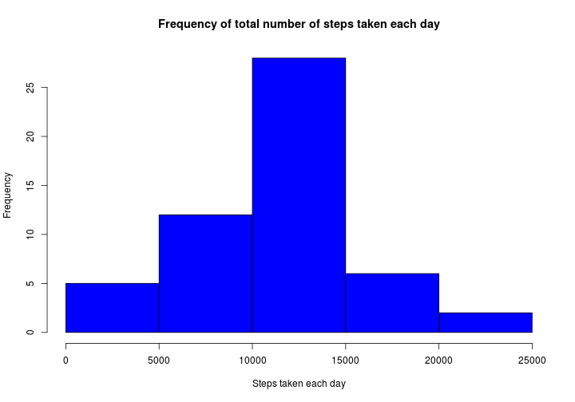

# Reproducible Research: Peer Assessment 1

## Introduction
In this assignment for Coursera's Reproducible Research class, data from a personal activity monitoring deviced is going to be  analyzed. The device collects data at 5 minute intervals through out the day. The data consists of two months of data from an anonymous individual collected during the months of October and November, 2012 and include the number of steps taken in 5 minute intervals each day.

## Loading and preprocessing the data
First of all, the activity.csv file is read from the activity.zip file provided by this assignment's git repository and it's date variable is converted to R's native date object.


```r
data <- read.csv(unz("./activity.zip", "activity.csv"))
data$date <- as.Date(data$date, format = "%Y-%m-%d")
```


## What is mean total number of steps taken per day?
To see the distribuition of steps taken by day, the number of steps taken each day must be aggregated before drawing the histogram.

```r
stepsByDay <- aggregate(. ~ date, data = data, sum)
hist(stepsByDay[, 2], main = "Frequency of total number of steps taken each day", 
    col = "blue", xlab = "Steps taken each day")
```

 


Then the mean and median are then calculated:

```r
mean(stepsByDay[, 2], na.rm = TRUE)
```

```
## [1] 10766
```

```r
median(stepsByDay[, 2], na.rm = TRUE)
```

```
## [1] 10765
```


## What is the average daily activity pattern?
In order to display the average daily activity pattern, the number of steps average is taken, grouped by interval.

```r
avgByInterval <- aggregate(steps ~ interval, data = data[, c(1, 3)], mean)
plot(avgByInterval$interval, avgByInterval$steps, type = "l", xlab = "Interval", 
    ylab = "Average number of steps", main = "Average daily activity pattern")
```

 

The interval with the highest average number of steps is: 

```r
avgByInterval[avgByInterval$steps == max(avgByInterval$steps), ][, 1]
```

```
## [1] 835
```


## Imputing missing values


## Are there differences in activity patterns between weekdays and weekends?
